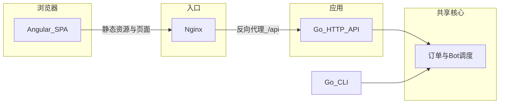

# 架构与接口设计

## 1. 总体架构



- **Angular**：构建产物由 Nginx 托管；浏览器通过同源或反代访问 `/api`。
- **Go HTTP**：仅负责 JSON API、CORS（开发环境）、调用领域层。
- **Go CLI**：满足作业脚本；**建议子命令分离**：
  - `run-demo`（或等价）：非交互，输出带时间戳的日志，供 `run.sh` 重定向到 `scripts/result.txt`。
  - `interactive`：交互式命令，供面试演示，**不写**入 CI 必需的 `result.txt` 流程。

**语言约定**：面向用户/阅卷的 **README、Angular UI、`result.txt`、CLI 提示与 JSON 中展示给前端的可读文案** 使用 **英文**；**`docs/` 与本仓库源码注释** 使用 **中文**（见 [实施方案.md](实施方案.md) §4、[文档索引.md](文档索引.md)）。

## 2. 领域模型（建议）

### 2.1 实体

- **Order**：`id`（全局递增）、`kind`（Normal / VIP）、`status`（PENDING / PROCESSING / COMPLETE）。
- **Bot**：`id`（创建顺序递增）、当前绑定订单（无则为空闲）、处理任务的取消函数（用于 -Bot）。

### 2.2 队列语义

- **PENDING**：逻辑上为 `VIP队列 || Normal队列`（两段均为 FIFO）。
- **取单规则**：始终从 VIP 队列头部取；VIP 空则从 Normal 队列头部取。
- **新单入队**：Normal 追加到 Normal 段尾；VIP 追加到 VIP 段尾。

### 2.3 调度规则

- **+Bot**：在 Bot 列表末尾追加新 Bot；立即触发一次 **调度**。
- **多 Bot 同时空闲时的派单顺序（已固定）**：按 **Bot 创建顺序（`id` 从小到大）** 遍历每个 Bot；若该 Bot 空闲且 PENDING 非空，则为其分配 **当前队列规则下的下一单**（先 VIP 队头，再 Normal 队头）。一轮调度中可连续为多个空闲 Bot 派单，直到无单或无空闲 Bot。
- **处理完成**：订单进 COMPLETE，该 Bot 变空闲，再次触发调度。
- **-Bot**：删除 **最后创建**的 Bot（即当前 Bot 列表中 **id 最大** 的那一个）：
  - 若空闲：直接移除。
  - 若处理中：**取消**处理（`context.Cancel` 或等价）；订单 **不** 进 COMPLETE，状态回到 PENDING，并插入 **对应 VIP 或 Normal 子队列**；**同类型内按订单 ID 升序** 插入，以恢复与「先到先得」一致的相对顺序。
- **R6「回原位」与递增 ID 的前提**：上述按 ID 插回 **仅在「全局订单号单调递增且与下单顺序一致」时** 等价于作业中的「原位置」。若将来改为 UUID 等无序 ID，必须在离队时保存 **队列下标或前驱/后继关系**，不可再单靠 ID 排序。

### 2.4 并发与竞态

- 处理协程在定时结束与取消同时就绪时，**完成前必须再次检查取消**，避免误将已撤销订单标为 COMPLETE。
- 公共状态使用 `sync.Mutex`（或读写锁）保护；持锁范围尽量小。

## 3. HTTP API 草案（REST）

以下为建议，实现时可微调路径，但需在 [实施方案.md](实施方案.md) 验收表中保持一致。

| 方法 | 路径 | 说明 |
|------|------|------|
| POST | `/api/orders` | Body：`{ "kind": "normal" \| "vip" }`，创建订单 |
| POST | `/api/bots` | Body：`{ "action": "add" \| "remove" }`，增减 Bot |
| GET | `/api/state` | 返回快照：`pending[]`、`processing[]`、`complete[]`、`bots[]` |

**快照字段示例（JSON）**

- `pending` / `processing` / `complete`：`{ id, kind, status }`
- `bots`：`{ id, idle, orderId? }`

**CORS**：开发阶段允许 `localhost`；生产由同源 Nginx 反代，可收紧。

## 4. 建议仓库目录结构

```
/cmd/feedme          # CLI（run-demo、interactive）
/cmd/server          # HTTP 服务入口
/internal/feedme     # 领域：队列、Bot、调度（中文注释）
/frontend            # Angular 工程
/deploy              # 可选：docker-compose、Dockerfile、nginx 配置片段
/conf/nginx          # 可选：与 anycolor 类似的 default.conf
/scripts             # test.sh、build.sh、run.sh（作业已有）
```

**Angular 构建输出路径**（实现时三处保持一致：Angular `angular.json`、`Dockerfile` 拷贝路径、Nginx `root`）：

- 建议统一为例如：`frontend/dist/feedme/browser`（以 `ng build` 实际 `outputPath` 为准，在首次实现时写入 README 或本文档附录）。

## 5. 与 `scripts` 的衔接

**目录名**：作业 PDF/README 可能写 `script`；本仓库目录为 **`scripts/`**，以下路径以此为准。

- [scripts/build.sh](../scripts/build.sh)：**至少**编译 CLI（`cmd/feedme`）到仓库根或 `bin/` 下约定名称，以满足 GitHub Actions。可选同时编译 `cmd/server`；API 容器也可仅由 Dockerfile 构建。
- [scripts/run.sh](../scripts/run.sh)：执行 `feedme run-demo > scripts/result.txt`（或等价），保证文件中每行或关键行含 `HH:MM:SS`。
- [scripts/test.sh](../scripts/test.sh)：`go test ./...`。
- [scripts/result.txt](../scripts/result.txt)：可为示例占位；实现后由 `run.sh` 覆盖生成。

## 6. 扩展点（非首版必做）

- 实时推送：SSE / WebSocket 替代轮询。
- 配置化：处理时长、日志级别、监听端口环境变量。
- 观测：结构化日志、简单 `/healthz`。

## 7. 相关文档

- [实施方案.md](实施方案.md)
- [实施细节补充.md](实施细节补充.md)（HTTP 状态码、环境变量、交互 CLI 命令表、`result.txt` 格式、验收剧本）
