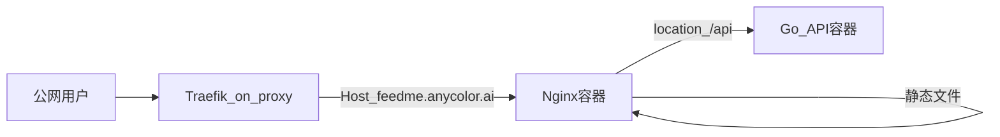

# 线上部署说明（feedme.anycolor.ai）

## 1. 目标

- 将 **Angular 静态资源** 与 **Golang API** 部署到公网，域名 **`feedme.anycolor.ai`**。
- 技术路线与本地参考工程 **`references/anycolor`** 对齐：Docker + Nginx + 外部 Traefik 网络 **`proxy`**，通过 **Traefik labels** 暴露 HTTPS。

> 说明：`references/` 已在根 [.gitignore](../.gitignore) 中忽略，仅作本地查阅；部署时以本文档与 anycolor 仓库实际文件为准。

## 2. 与 anycolor 的差异

| 项目 | anycolor（参考） | FeedMe |
|------|------------------|--------|
| 内容 | 纯静态 `public/` | Angular `dist` + **后端 API** |
| 容器 | 通常仅 Nginx | **Nginx（静态 + 反代）** + **Go API 容器** |
| 域名 | `www.anycolor.ai` / `anycolor.ai` | **`feedme.anycolor.ai`**（是否再要 `www` 由运维决定） |

参考文件（本地路径）：`references/anycolor/docker-compose.yml`、`Dockerfile`、`conf/nginx/anycolor.conf`。

## 3. 推荐拓扑



- Traefik 只暴露 **Nginx** 的 80（容器内）；Nginx 将 `/api`（或 `/api/`）转发到 `api:8080`（端口以实现为准）。
- Angular 使用 `try_files` 回退到 `index.html`，支持前端路由。

## 4. 前置条件（服务器一次性）

1. 已存在 Docker 外部网络 **`proxy`**（与 anycolor 相同）：
   - `docker network ls | grep proxy`
   - 若不存在：`docker network create --driver bridge proxy`（子网可与现有集群约定一致）。
2. 主机上 Traefik 已接入 `proxy` 网络，且证书解析器（如 `cloudflare`）已配置通配符 **`*.anycolor.ai`**（与 anycolor 一致则 `feedme` 子域自动受益）。
3. DNS：**`feedme.anycolor.ai`** A/AAAA 或 CNAME 指向与现有 anycolor 相同的入口。

## 5. Compose 与 Traefik 标签（示例草案）

以下为 **设计模板**，实现时在仓库 `deploy/docker-compose.yml`（或根目录）落地，并替换镜像名、服务名。

要点：

- `networks.proxy.external: true`
- Nginx 服务：`traefik.enable=true`，`traefik.docker.network=proxy`
- `traefik.http.services.feedme-svc.loadbalancer.server.port=80`
- `traefik.http.routers.feedme.rule=Host(\`feedme.anycolor.ai\`)`
- `entrypoints=websecure`、`tls.certresolver=...` 与 anycolor 保持一致风格

（具体 label 键名需与现场 Traefik 版本一致；可复制 anycolor 的 `docker-compose.yml` 后改名。）

## 6. Nginx 配置要点

- `root` 指向 Angular 构建产物目录（与 [架构与接口设计.md](架构与接口设计.md) 中约定路径一致）。
- **推荐反代写法（与后端路由 `/api/...` 一致）**：保留路径前缀，避免双写或丢失 `/api`。下面示例中 Go 服务监听 `8080`，Docker Compose 服务名为 `api`（请与实现一致）。

```nginx
server {
    listen 80;
    server_name feedme.anycolor.ai;

    root /app/web;
    index index.html;

    location /api/ {
        proxy_pass http://api:8080/api/;
        proxy_http_version 1.1;
        proxy_set_header Host $host;
        proxy_set_header X-Real-IP $remote_addr;
        proxy_set_header X-Forwarded-For $proxy_add_x_forwarded_for;
        proxy_set_header X-Forwarded-Proto $scheme;
    }

    location / {
        try_files $uri $uri/ /index.html;
    }
}
```

- 若后端 **不带** `/api` 前缀而仅使用 `/orders` 等路径，则应改用 `location /api/ { proxy_pass http://api:8080/; }` 并统一前后端约定——**本设计以 API 草案中带 `/api` 为准**，请勿混用两种风格。
- 可选：`gzip`、`Cache-Control` 对带 hash 的静态资源长期缓存。

## 7. 构建与发布流程（建议）

1. 在 CI 或本机：`ng build --configuration production`。
2. `go build` 构建 API 镜像（多阶段 Dockerfile：一阶段前端 build，一阶段 Go build，最终运行镜像仅含二进制 + 最小基础镜像；或 Nginx 与 API 分两镜像）。
3. 服务器 `docker compose pull && docker compose up -d`（或 GitLab CI 恢复后自动执行；**当前 GitLab 不可用，仅人工或脚本**）。

## 8. 健康检查与回滚

- API 提供 `GET /healthz` 或复用 `GET /api/state` 作为存活探针（实现阶段确定）。
- 回滚：保留上一版镜像 tag；`docker compose up -d` 指回旧 tag。

## 9. 安全建议（简）

- 首版可无登录；若公网暴露，建议限制管理类操作（若未来增加）或加简单 Token。
- 不在仓库提交 TLS 私钥、Cloudflare token；通过服务器环境变量或密钥管理注入。
